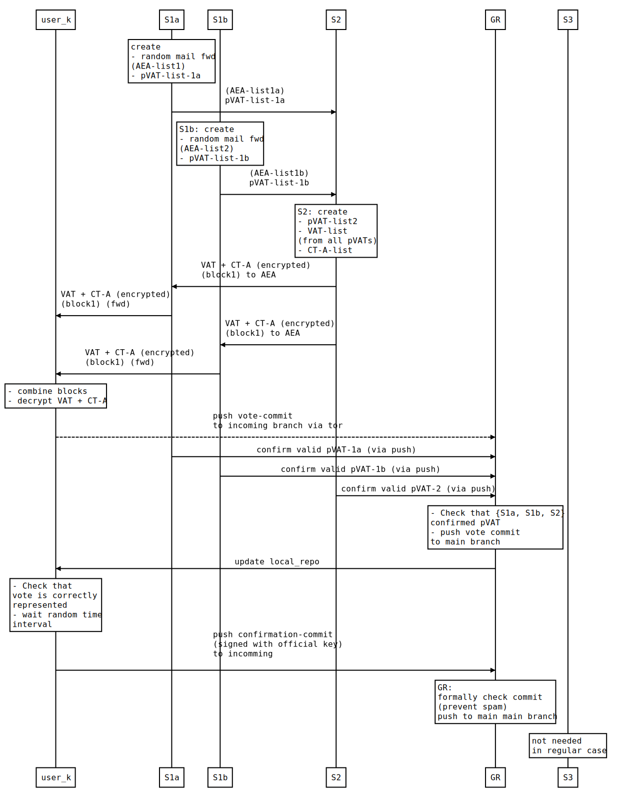

# Proposing a Verifiable Anonymous Voting System Based on Git, Email, GPG, and Tor

`__version__ = "0.5.1"`

## Preliminary Notes

As far as I know, there is currently no secure online voting system. The following thoughts were triggered by the turbulences around the US presidential elections 2020, the ongoing protests in Belarus and the discussion about voting on online party conventions in Germany. I am neither an expert in (online) voting systems nor in cybersecurity. Instead I am just a regular user of email, gpg, git and tor and I am interested in how groups can manage the problem of decision-making without disintegrating.

As the above version number suggests the proposal has evolved since its initial publication mainly due to feedback. It is probably not trivial to understand. Visualization is in preparation.

The proposal does contain some flaws which I am aware of and probably many more. Nevertheless, it might be a starting point for something working. The assumptions below are in part admittedly unrealistic (E.g. "Each user can use git and gpg"). They are stated this way to simplify the explanation of the voting protocol. I am confident that they can be relaxed w.r.t. to usability and robustness with a more elaborated approach and by implementing most of the user-activities in an (optional) open-source software frontend.

## Motivation

(This section was included later in repsonse to questions and citicism. It is not necessary to technically understand the rest.)

### Why Should the Free Software Community Think About Online Voting?

1. Currently high medial awareness due to US presidential elections and a significant amount of people who claim irregularities.
2. Good chance to point out the importance of transparency, credibility, signatures, encryption, and anonymity.
3. Good chance to raise awareness for established tools like *git*, *gpg* and *tor* outside of the tech bubble.
4. Very good possibility to point out an positively framed use case for online anonymity and *tor*.
5. If digital voting will come, it must at least be based on Free and Open Source Software and community-approved concepts.
6. The usage of established tools (git, gpg, tor) increase the level of understandability (e.g. compared to blockchain-based approaches).

### General Arguments for Online Voting

1. Lower participation hurdle for voters
    - Nobody wants to wait for hours in a line outside.
    - Nobody wants to visit a voting station if there are attack warnings or other intimidation mechanisms.
2. Much Lower cost for holding a reliable election/voting (on almost any organizational level).
    - Allows the integration of more participative democratic elements (which is another complex topic, see below).

### General Arguments against Online Voting

... and attempts for counter arguments

1. Possible attacks might scale very well (same effort for corrupting 10K votes as for 10 votes).
    - Countermeasures:
        - Independently controlled redundant systems (like for a block chain)
        - High degree of initial robustness: Even corrupting 10 votes should be very hard.
2. Private devices are mostly insecure (not up to date, malware, ...).
    - This is a general societal problem which is urgent to solve (not only for online voting).
    - Online voting could give big incentives for the public sector to provide enough resources to support users. Maintaining a secure digital device is currently much harder then it should be.
    - Additional Ideas:
        - Provide Linux live distribution which boots from a USB drive and has all necessary voting software installed.
        - Running voting software inside a virtual machine (assuming that it is hard to break into a VM from a malware-infected host).
        - Do not support phones and tablets as they are too malware prone.
            - Additional benefit: Raise awareness for this problem.
        - Provide (used) devices (PCs, notebooks) with Free Software for households that need one.
            - Additional benefit: This device could also be used for education.
3. Availability of cheap and legally safe online voting could raise the political pressure towards weakening parliaments in favor of plebiscites. This could lead to much more "populist" politics and increase the influence of unbalanced media and misinformation.
    - Unbalanced media and misinformation are general problems for (democratic) societies. An online voting procedure which is based on transparent processes and verifiability and not on the principle "Trust me, I tell the truth", could foster a more critical approach in media consumption and media production. It could raise the bar in what people believe and what not.
    - The decision about plebiscites (on which levels, for which kinds of issues, who can initiate and formulate them, ...) should be up to the sovereign anyway.

### Personal Conclusion of General Arguments

Voting is a delicate act. Digital voting bears many dangers (see assumptions above), but so does paper voting (see current and historical examples). In any case, I would prefer a Free and Open Source approach based on established and trusted tools and principles instead of someday using *facebook vote®*.

## Guiding principles

1. When it comes to voting there is no single trusted authority.
1. Only Free and Open Source Software can be trustable software.
1. Transparency prevents fraud and unjustified accusations of fraud.
1. Power and sensitive knowledge for each entity must be divided sufficiently such that fraud is impossible without conspiration with other entities.
1. Each entity must have strong rational incentives to comply with the rules and to report any attempts of conspiration ("immune system").

## Assumptions:

1. $N users want (and are entitled) to vote.
1. $N < 100.
2. No user shall vote more than once.
3. The fact of whether they voted can be public, the voting content shall be anonymous.
4. There is a predefined time interval in which voting is allowed.
5. Each user has an official email address (say `user-$i@voting.org`) to which they have exclusive access to.
6. Each user can use git and gnupg.
7. Every user has a pgp key-pair and the public key is known to everyone else and associated with this user.
9. There are five servers operated by independent actors that do not cooperate against the rules. In particular, they do not share unauthorized information among them nor with the public.
    - Server 1a (S1a)
    - Server 1b (S1b)
    - Server 2 (S2)
    - Server 3 (S3)
    - A public git repository for voting results (GR)
10. Every user has push-access to the `incoming`-branch.
10. S1a, S1b, S2 have push access to the branches `confirmed-pVAT1a`, `confirmed-pVAT1b`, and `confirmed-pVAT2`, respectively
12. The public key for each server is known to and trusted by all users. This can be ensured during voter registration.
11. The servers for the infrastructure and the devices on which the users vote are not corrupted and are secured against unauthorized access.

## How it works (regular case)

1. S1 generates $N partial voting authorization tokens (pVATs).
1. S1 generates $N anonymous email addresses (AEAs) like `anonymous-$j@voting.org` and associates them randomly to the $N official user addresses via email forwarding (S1 must run a mail server). The association table is kept secret by S1. Especially S2 is not allowed to know the associations.
1. S1 sends the list of all pVATs and all AEAs to S2.
1. S2 also generates $N pVATs. Then S2 combines randomly each pVAT from S1 with one pVAT from S2 and thereby forms a complete voting authorization token (VAT).
1. S2 also generates $N confirmation tokens of kind A (CT-A).
1. S2 associates randomly one VAT and one CT-A. This mapping is kept secret by S2, especially to S3.
1. S2 sends one VAT-CT-A-pair to each anonymous e-mail address. Because the final recipient is unknown to S2, each email is encrypted with **all** $N public keys. Each email must also contain some random data to prevent S1 to create the ciphertext by itself and thus break anonymity when the VATs become public later. Each email is signed with the official signature of S2.
1. User $k receives exactly one encrypted mail with one VAT-CT-A-pair signed by S2. They decrypt it with their own private key.
1. User $k clones the GR and makes an anonymous commit with a new text file (votes/$RANDOMNAME1) containing "$VAT: $VOTING_CONTENT". The CT-A might be used later.
1. User $k pushes this commit over an anonymous connection (via Tor) to the incoming branch of GR.
1. S{1a,1b,2} confirms that the commit contains a valid pVAT from its pVAT{1a,1b,2}-list and pushes it to the `confirmed-pVAT{1a,1b,2}` branch (one after another).
1. GR confirms that the other servers have confirmed the VAT and pushes the commit to the `main` branch.
1. User $k updates their version of the repo (`git pull`) and checks that their vote is correctly represented in the `main` branch.
1. After a random time delay (say 0.5 to 10 minutes) user $k commits a new text file (confirmations/$RANDOMNAME2) containing: "My vote is correctly represented.", signs this commit with their private key, and pushes it to incoming. Due to the signature, this commit is non-anonymous. But it is unrelated to the actual voting.
1. GR formally checks this commit (spam prevention) and pushes it to the `main` branch.

### Result and Remarks

1. After the voting interval is over the GR contains $n1 votes, where $n1 <= $N and the difference is assumed to have voluntarily not voted. It also contains $n2 confirmations where  0 <= $n2 <= N. If all users acted as they should we have $n1 = $n2.
2. The CT-A is needed only for confirmation of VTA (see below).

## What could go wrong and what happens then?

This section collects attack scenarios and responses. It probably grows over time.

1. $n2 < $n1 (not all votes are confirmed):
    - Possible reasons: a) There could have been problems between voting and confirmation (device failure, ...) or b) The user actively decides not to confirm.
    - To ensure integrity of the voting we only count confirmed votes. Challenge: filter out those VATs which are not confirmed without breaking anonymity.
        - S2 generates two more lists of confirmation tokens each list of length $n2: CT-B- and CT-C-list. The CT-A list was generated earlier and (as a whole) kept secret by S2. However, each user already has a personal CT-A from the first (anonymously received) email.
        - S2 publishes a list of all VAT-hashes, a list of all corresponding CT-A-hashes, and an unordered list of all CT-C hashes.
        - S2 sends both the CT-B- and CT-C-list to S3
        - S3 generates a random one-to-one mapping between CT-B and CT-C. This mapping is kept secret by S3.
        - S2 sends each of the $n2 users which did push a signed confirmation to GR an encrypted and signed email with a single CT-B.
        - User $k receives and decrypts the message with the CT-B
        - User $k receives an (encrypted to all users) message with a CT-C from S3 in exchange for (anonymously) sending a CT-B to S3.
        - User $k anonymously publishes their VAT, CT-A and CT-C in the repo.
        - Anybody can verify that this commit is valid by calculating the hashes and comparing them to the lists published and signed by S2. Invalid commits are removed from the repo by GR.
    - 
2. $n2 > $n1 (more confirmations than votes)
    - Can be ignored. Just count all the votes.
3. GR could inject manipulated commits or refuse to accept specific commits.
    - There should be multiple and independently controlled instances of GR. Each user can push their commit to several repos and check the integrity of those against each other.

## Claims

1. Anonymity
    - Only the user knows their VAT because of random assignation, encrypted emails, and anonymous connections.
    - No single entity alone can break anonymity. Either S1{a|b} or S3 must conspire with S2 to do this. It would be easy to add more independent data-mixing layers to increase the number of necessary participants in the conspiration.
2. Trust:
    - Any fraud against the users is detectable, each single user can confirm that their vote is represented in the result.
    - The result cannot reasonably be disputed if the number of votes and valid confirmations matches. This can be checked by everyone.
3. Fast and Transparent Evaluation
    - Voting could be evaluated by anyone because the source data is publicly available in plain text. Evaluation software can be very easy.

## Further Ideas

1. Specify a protocol on how to transparently file a complaint in an independent (and redundant) complaint repository (CR).
1. Specify a protocol for an inherent **immune system**: give infrastructure entities and users a high incentive to report any attempt to conspire
    - incentivize $A to falsely act as if they want to conspire with $B while having previously published an encrypted message. The key of which must be published at a given time.
    - These encrypted messages can obtain meaningful or random information. Many of them are automatically generated.
    - If $B does report this $A can prove its true intentions when publishing the key to its encrypted message.
    - If $B does not report this to CR but instead agrees to conspire, then $A can publish this agreement and identify $B as a potential conspirator.
    - There can be meta-levels to this.

## References (and commenting excerpts)

- [Why Electronic Voting Is Still A Bad Idea](https://www.youtube.com/watch?v=LkH2r-sNjQs), Tom Scott, 2020, youtube
    - Voting should be based on *trust* and *anonymity*.
    - In national elections there are probably high potential actors with huge budgets who want to influence the result to their favor.
    - Paper ballot version has matured over centuries → fair robustness against fraud attempts
    - Potential fraud mechanisms do not scale very well (easy for 10 votes, hard for 10K votes)
    - Voting machines are badly maintained can be attacked (irrelevant to this approach)
    - Voting from private devices is even more dangerous (virus infection, botnets, ...)
